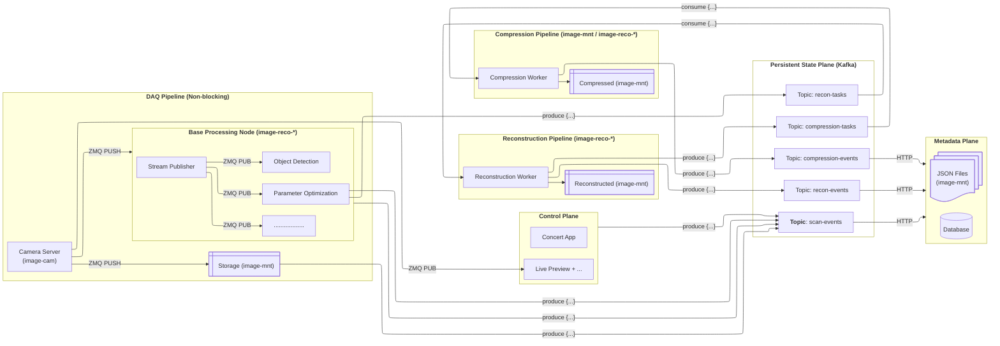

# High-Performance Streaming CT Pipeline

## Context
This document describes the proposed architecture for an automated, high-performance data streaming and processing pipeline for synchrotron CT experiments. The system is designed to handle **~1.6 GB/s burst data rates**, support **multiple online consumers**, and orchestrate **offline reconstruction and compression pipelines** with minimal operational complexity.

The design follows a strict separation between:
- **Hot data path** (raw projections)
- **Control & metadata path** (states, parameters, events)
- **Asynchronous batch processing** (reconstruction, compression)

---

## Key Design Principles

1. **ZMQ for raw data, Kafka for coordination**
2. **Disk is the source of truth** for projections
3. **Fan-out happens once**, at a base processing node
4. **Tasks reference data, never carry data**
5. **Explicit scan lifecycle state machine**

---

## High-Level Architecture

```
Camera
  ↓
Camera Server (ZMQ PUSH)
  ↓
Base Processing Node
  ├── ZMQ PUB → Online slice reconstruction
  ├── ZMQ PUB → Parameter optimization
  ├── ZMQ PUB → Live preview
  ├── Disk writer (projections)
  └── Kafka (state, metadata, tasks)

Kafka
  ├── Scan state & metadata
  ├── Reconstruction task queue
  └── Compression task queue

Reconstruction Workers
  ↓
Compression Workers
```

---

## Architectural Diagram



## Base Processing Node – Responsibilities

The base processing node is the **only component that sees the full raw stream**.

### Responsibilities
- Receive projections from camera server
- Fan-out projections to online consumers
- Perform lightweight online transformations
- Persist projections to disk
- Manage scan lifecycle states
- Enqueue offline processing tasks

### Non-responsibilities
- No buffering for replay
- No heavy computation
- No long-term persistence beyond disk writes

---

## Base Processing Node – Pseudo Implementation

### High-Level Structure

```python
class BaseProcessingNode:
    def __init__(self, zmq_ctx, Kafka, config):
        self.ctx = zmq_ctx
        self.Kafka = Kafka
        self.config = config

        self.pull_socket = self._init_pull()
        self.pub_sockets = self._init_pubs()
        self.disk_writer = DiskWriter(config.data_root)

        self.scan_id = None

    def run(self):
        while True:
            frame = self.pull_socket.recv()
            self.handle_frame(frame)
```

---

### Initialization

```python
def _init_pull(self):
    s = self.ctx.socket(zmq.PULL)
    s.bind(self.config.camera_endpoint)
    return s


def _init_pubs(self):
    pubs = {}
    for name, endpoint in self.config.pub_endpoints.items():
        s = self.ctx.socket(zmq.PUB)
        s.bind(endpoint)
        pubs[name] = s
    return pubs
```

---

### Scan Start

```python
def start_scan(self, scan_id, metadata):
    self.scan_id = scan_id
    self.Kafka.hset(f"scan:{scan_id}", mapping=metadata)
    self.Kafka.set(f"scan:{scan_id}:state", "ACQUIRING")
    self.disk_writer.open(scan_id)
```

---

### Frame Handling (Hot Path)

```python
def handle_frame(self, frame):
    if self.Kafka.get(f"scan:{self.scan_id}:state") == "ACQUIRING":
        self.Kafka.set(f"scan:{self.scan_id}:state", "STREAMING")

    # Write raw frame to disk
    self.disk_writer.write(frame)

    # Fan-out to online consumers
    self.pub_sockets["preview"].send(frame, zmq.NOBLOCK)

    # Downsampled version for online recon
    reduced = downsample(frame)
    self.pub_sockets["slice_recon"].send(reduced, zmq.NOBLOCK)
```

---

### Scan End

```python
def end_scan(self):
    self.disk_writer.close()
    self.Kafka.set(f"scan:{self.scan_id}:state", "ACQUIRED")

    task = {
        "scan_id": self.scan_id,
        "projection_path": self.disk_writer.path,
    }

    self.Kafka.lpush("recon_queue", json.dumps(task))
    self.Kafka.set(f"scan:{self.scan_id}:state", "QUEUED_FOR_RECON")
```

---

## Why This Node Scales

- One inbound stream
- Many outbound subscribers
- Stateless with respect to frames
- Restart-safe (disk + Kafka)
- Easy to extend with new online consumers

---

## Summary

This architecture:
- Handles multi-GB/s burst acquisition
- Supports rich online feedback
- Keeps the technology stack minimal
- Cleanly separates concerns
- Matches real beamline operational constraints

The base processing node is the **keystone**: simple, fast, and disciplined.
