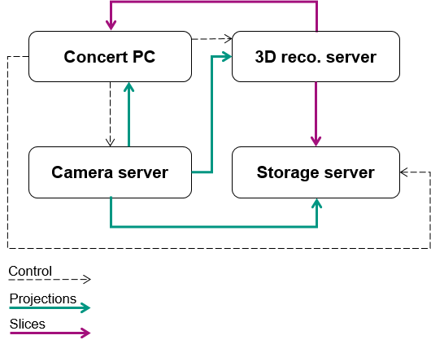

===========
Experiments
===========

Experiments perform the data acquisition and send the data to consumers.  They
consist of :class:`.Acquisition` objects which connect data producers with
consumers for a particular experiment part (dark fields, projections, ...). This
way the experiments can be divided into smaller logical pieces. Data consumers
are implemented by various :class:`.Addon` classes (e.g.  image writing, live
view, ...), which can be attached to or detached from experiments dynamically.

Data handling can be realized `locally` or `remotely`. Local data handling keeps
all data in your concert session, which may lead to performance decrease. Remote
data handling means that the producer lives on a separate computer and all
addons as well and concert merely organizes the data links by `ZMQ
<https://pyzmq.readthedocs.io/en/latest/>`_ and the synchronization of the data
acquisition.  This is the preferred way because it lifts the burden of data
processing from your concert session. Below you can find examples for
:ref:`local <local-exp>` and :ref:`remote <remote-exp>` experiments.
Schematically, the data and control links of the latter are:

Running an experiment
---------------------

:class:`~.base.Experiment` makes sure all acquisitions are executed and all
producers are connected to all consumers. To demonstrate how a typical
experiment can be run in an empty session with dummy devices::

    from concert.storage import DirectoryWalker
    from concert.ext.viewers import PyplotImageViewer
    from concert.experiments.addons import local as local_addons
    from concert.devices.motors.dummy import LinearMotor, ContinuousRotationMotor
    from concert.devices.cameras.dummy import Camera
    from concert.devices.shutters.dummy import Shutter

    # Import experiment
    from concert.experiments.synchrotron import LocalContinuousTomography

    # Devices
    camera = await Camera()
    shutter = await Shutter()
    flat_motor = await LinearMotor()
    tomo_motor = await ContinuousRotationMotor()

    viewer = await PyplotImageViewer()
    walker = await DirectoryWalker()
    exp = await LocalContinuousTomography(walker=walker,
                                     flat_motor=flat_motor,
                                     tomography_motor=tomo_motor,
                                     radio_position=0*q.mm,
                                     flat_position=10*q.mm,
                                     camera=camera,
                                     shutter=shutter)

    # Attach live_view to the experiment
    live = await local_addons.LiveView(viewer, exp)

    # Attach image writer to experiment
    writer = await local_addons.ImageWriter(exp)

    # Run the experiment
    f = exp.run()

    # Wait until the experiment is done
    await f

Experiments also have a :py:attr:`.base.Experiment.log` attribute, which gets a
new handler on every experiment run and this handler stores the output in the
current experiment working directory defined by it's
:class:`concert.storage.DirectoryWalker`.

.. _local-exp:

Local dummy file experiment
---------------------------

The following session illustrates how to use an
:class:`~concert.experiments.dummy.ImagingFileExperiment` together with
:class:`~concert.experiments.addons.local.LiveView`,
:class:`~concert.experiments.addons.local.ImageWriter` and
:class:`~concert.experiments.addons.local.OnlineReconstruction` addons::

    import numpy as np
    import logging
    import concert
    concert.require("0.33.0")

    from concert.devices.cameras.dummy import FileCamera
    from concert.devices.shutters.dummy import Shutter
    from concert.devices.motors.dummy import ContinuousRotationMotor, ContinuousLinearMotor
    from concert.quantities import q
    from concert.experiments.addons import local as local_addons
    from concert.experiments.dummy import ImagingFileExperiment
    from concert.storage import DirectoryWalker
    from concert.ext.viewers import PyQtGraphViewer, PyplotImageViewer
    from concert.ext.ufo import GeneralBackprojectArgs, GeneralBackprojectManager

    concert.config.PROGRESS_BAR = False
    LOG = logging.getLogger(__name__)

    viewer = await PyQtGraphViewer(show_refresh_rate=True)
    slice_viewer = await PyQtGraphViewer(show_refresh_rate=True, title="Slices")

    num_radios = 3000

    walker = await DirectoryWalker(
        root='/mnt/fast/tests',
        bytes_per_file=2 ** 40,
    )
    flat_motor = await ContinuousLinearMotor()
    rot_motor = await ContinuousRotationMotor()
    shutter = await Shutter()
    vert_motor = await ContinuousLinearMotor()

    camera = await FileCamera("/mnt/fast/CT42/radios/*.tif")
    await camera.set_roi_y0(800 * q.px)
    await camera.set_roi_height(200 * q.px)
    # Imaging file dummy experiment
    ex = await ImagingFileExperiment(
        camera,
        100,
        100,
        num_radios,
        darks_pattern='/mnt/fast/CT42/darks',
        flats_pattern='/mnt/fast/CT42/flats',
        radios_pattern='/mnt/fast/CT42/radios',
        walker=walker,
    )

    # Live view
    live = await local_addons.LiveView(viewer, ex)

    # Writer
    writer = await local_addons.ImageWriter(ex)

    # Online Reco
    reco = await local_addons.OnlineReconstruction(
        ex,
        do_normalization=True,
        average_normalization=True,
        slice_directory="online-slices",
        viewer=slice_viewer
    )
    await reco.set_region([0., 1., 1.])
    await reco.set_center_position_x([1009.0] * q.px)
    await reco.set_fix_nan_and_inf(True)
    await reco.set_absorptivity(True)
    await reco.set_center_position_z([0.5] * q.px)
    await reco.set_number(num_radios)
    await reco.set_overall_angle(np.pi * q.rad)

.. _remote-exp:

Remote dummy file experiment
----------------------------

The following session illustrates the remote version of the experiment above.
Cameras in concert can send images over network, so we can just use the file
camera here as well. The following session uses a
:class:`~concert.experiments.dummy.RemoteFileImagingExperiment` together with
:class:`~concert.experiments.addons.tango.LiveView`,
:class:`~concert.experiments.addons.tango.ImageWriter` and
:class:`~concert.experiments.addons.tango.OnlineReconstruction` addons::

    import logging
    import numpy as np
    import os
    import zmq
    import concert
    import time
    concert.require("0.33.0")

    from concert.devices.cameras.dummy import FileCamera
    from concert.helpers import CommData
    from concert.quantities import q
    from concert.networking.base import get_tango_device
    from concert.experiments.addons import tango as tango_addons
    from concert.experiments.dummy import RemoteFileImagingExperiment
    from concert.storage import RemoteDirectoryWalker
    from concert.ext.viewers import PyQtGraphViewer
    from concert.experiments.addons.tango import (
        ImageWriter as TangoRemoteWriter,
        OnlineReconstruction as TangoOnlineReconstruction,
        LiveView as TangoLiveView
    )

    concert.config.PROGRESS_BAR = False
    LOG = logging.getLogger(__name__)
    viewer = await PyQtGraphViewer(show_refresh_rate=True)
    slice_viewer = await PyQtGraphViewer(show_refresh_rate=True, title="Slices")
    num_radios = 3000

    SERVERS = {
            "writer": CommData("localhost", port=8992, socket_type=zmq.PUSH),
            "reco": CommData("localhost", port=8993, socket_type=zmq.PUSH),
            "live": CommData("localhost", port=8995, socket_type=zmq.PUB, sndhwm=1),
    }

    walker_device = get_tango_device(f'{os.uname()[1]}:1238/concert/tango/walker#dbase=no', timeout=1000 * q.s)
    walker = await RemoteDirectoryWalker(
        device=walker_device,
        root='/mnt/fast/tests',
        bytes_per_file=2 ** 40,
    )

    camera = await FileCamera("/mnt/fast/CT42/radios/*.tif")
    await camera.set_roi_y0(800 * q.px)
    await camera.set_roi_height(200 * q.px)
    ex = await RemoteFileImagingExperiment(
        camera,
        100,
        100,
        num_radios,
        darks_pattern='/mnt/fast/CT42/darks',
        flats_pattern='/mnt/fast/CT42/flats',
        radios_pattern='/mnt/fast/CT42/radios',
        walker=walker,
    )

    # Live View
    if "live" in SERVERS:
        live = await TangoLiveView(viewer, SERVERS["live"], ex)

    # Writer
    writer = await tango_addons.ImageWriter(ex, SERVERS["writer"])

    # Online Reco
    if "reco" in SERVERS:
        reco_device = get_tango_device(f'{os.uname()[1]}:1237/concert/tango/reco#dbase=no', timeout=1000 * q.s)
        # await reco_device.write_attribute('endpoint', SERVERS["reco"].client_endpoint)
        reco = await tango_addons.OnlineReconstruction(reco_device, ex,
                                                       SERVERS["reco"],
                                                       do_normalization=True,
                                                       average_normalization=True,
                                                       slice_directory="online-slices",
                                                       viewer=slice_viewer)
        await reco.set_region([0., 1., 1.])
        await reco.set_center_position_x([1009.0] * q.px)
        await reco.set_fix_nan_and_inf(True)
        await reco.set_absorptivity(True)
        await reco.set_center_position_z([0.5] * q.px)
        await reco.set_number(num_radios)
        await reco.set_overall_angle(np.pi * q.rad)
        # Online reco uses its own separate walker for writing
        await reco_device.setup_walker(
            [
                f'{os.uname()[1]}:2238/concert/tango/walker#dbase=no',
                '/mnt/fast/tests',
                "tcp", "localhost", "8996"
            ]
        )

The experiment above needs tango servers for the respective addons to be
started, which can be done by::

    concert tango reco --port 1237
    concert tango walker --port 1238
    concert tango walker --port 2238

Addons
------

Addons typically provide consumers for different kinds of acquisitions in an
experiment. E.g., online 3D reconstruction will average the dark fields and flat
fields and trigger the reconstruction in the acquisition taking the projections.
Addons attach themselves to experiment acquisitions upon creation and can be
later detached from them. They can be `local` or `remote`, depending on where
the data comes from. For example, to save images on disk locally::

    from concert.experiments.addons.local import ImageWriter

    # Let's assume an experiment is already defined
    writer = ImageWriter(experiment)
    # Now images are written on disk
    await experiment.run()
    # Do not write images anymore
    await writer.detach()

Experiment base module
----------------------

.. automodule:: concert.experiments.base
    :members:

Dummy experiments
-----------------

.. automodule:: concert.experiments.dummy
    :members:

Addon classes
-------------

.. automodule:: concert.experiments.addons.base
    :members:
   
.. automodule:: concert.experiments.addons.local
    :members:

.. automodule:: concert.experiments.addons.tango
    :members:

Advanced
--------

Sometimes we need finer control over when exactly is the data acquired and worry
about the download later. We can use the *acquire* argument to acquisition
class. This means that the data acquisition can be invoked before data download.
Acquisition calls its *acquire* first and only when it is finished connects
producer with consumers.

The Experiment class has the attribute
:py:attr:`.base.Experiment.ready_to_prepare_next_sample` which is an instance of
an :class:`asyncio.Event`. This can be used to tell that most of the experiment
is finished and a new iteration of this experiment can be prepared (e.g. by the
:class:`concert.directors.base.Director`.  In the :meth:`.base.Experiment.run`
the :py:attr:`.base.Experiment.ready_to_prepare_next_sample` will be set that at
the end of an experiment is is always set. In the beginning of the
:meth:`.base.Experiment.run` it will be cleared.  This is an example
implementation making use of this::

	from concert.experiments.base import Experiment, Acquisition
	class MyExperiment(Experiment):
		async def __ainit__(self, walker, camera):
			acq = Acquisition("acquisition", self._produce_frames)
			self._camera = camera
			await super().__ainit__([acq], walker)

		async def _produce_frame(self):
			num_frames = 100
			async with self._camera.recording():
				# Do the acquisition of the frames in camera memory

			# Only the readout and nothing else will happen after this point.
			self.ready_to_prepare_next_sample.set()

			async with self._camera.readout():
				for i in range(num_frames):
					yield await self._camera.grab()

Imaging experiments
-------------------

A basic frame acquisition generator which triggers the camera itself is provided by
:func:`.frames`

.. autofunction:: concert.experiments.imaging.frames

There are tomography helper functions which make it easier to define the proper
settings for conducting a tomographic experiment.

.. autofunction:: concert.experiments.imaging.tomo_angular_step

.. autofunction:: concert.experiments.imaging.tomo_projections_number

.. autofunction:: concert.experiments.imaging.tomo_max_speed

Synchrotron and X-Ray tube experiments
--------------------------------------

In :py:mod:`concert.experiments.synchrotron` and :py:mod:`concert.experiments.xraytube` experiment classes for
Radiography, SteppedTomography, ContinuousTomography and SteppedSpiralTomography,
ContinuousSpiralTomography and GratingInterferometryStepping are implemented for
the two different source types as local and remote experiments.

For detailed information how they are implemented, you can have a look at the
base classes :class:`~concert.experiments.imaging.Radiography`,
:class:`~concert.experiments.imaging.Tomography`,
:class:`~concert.experiments.imaging.SteppedTomography`,
:class:`~concert.experiments.imaging.ContinuousTomography`,
:class:`~concert.experiments.imaging.SteppedSpiralTomography`,
:class:`~concert.experiments.imaging.ContinuousSpiralTomography` and
:class:`~concert.experiments.imaging.GratingInterferometryStepping`.

In the standard configuration, all tomography and radiography experiments first
acquire the dark images, then the flat images and the projection images of the
sample at the end. This order can be adjusted by the
:func:`~concert.experiments.base.Experiment.swap` command.

You can find more details on the different experiments in :ref:`Experiment implementations <exp-implementations>`.

Control
-------

.. automodule:: concert.experiments.control
    :members:
