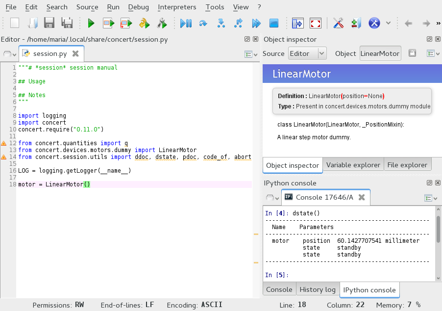

==================
Command line shell
==================

Concert comes with a command line interface that is launched by typing
``concert`` into a shell. Several subcommands define the action of the tool.

Session commands
================

The ``concert`` tool is run from the command line.  Without any arguments, its
help is shown::

    $ concert
    usage: concert [-h] [--version]  ...

    optional arguments:
      -h, --help  show this help message and exit
      --version   show program's version number and exit

    Concert commands:

        init      Create a new session
        edit      Edit a session
        log       Show session logs
        show      Show available sessions or details of a given *session*
        mv        Move session *source* to *target*
        cp        Copy session *source* to *target*
        rm        Remove one or more sessions
        import    Import an existing *session*
        export    Export all sessions as a Zip archive
        start     Start a session
        docs      Create documentation of *session* docstring
        spyder    Start session using Spyder

The tool is command-driven, that means you call it with a command as its first
argument. To read command-specific help, use::

    $ concert [command] -h

.. note::

    When Concert is installed system-wide, a bash completion for the
    ``concert`` tool is installed too. This means, that commands and options
    will be completed when pressing the :kbd:`Tab` key.

.. _init-command:

init
----

.. program:: concert init

Create a new session with the given name::

    concert init experiment

If such a session already exists, Concert will warn you.

    .. option:: --force

        Create the session even if one already exists with this name.

    .. option:: --imports

        List of module names that are added to the import list.

.. note::

    The location of the session files depends on the chosen installation method.
    If you installed into a virtual environment ``venv``, the files will be
    stored in ``/path/to/venv/share/concert``. If you have installed Concert
    system-wide our without using a virtual environment, it is installed into
    ``$XDG_DATA_HOME/concert`` or ``$HOME/.local/share/concert`` if the former
    is not set. See the `XDG Base Directory Specification
    <https://specifications.freedesktop.org/basedir-spec/basedir-spec-latest.html>`_
    for further information. It is probably a *very* good idea to put the
    session directory under version control.

.. _edit-command:

edit
----

.. program:: concert edit

Edit the session file by launching ``$EDITOR`` with the associated Python
module file::

    concert edit session-name

This file can contain any kind of Python code, but you will most likely just add
device definitions and import processes that you want to use in a session. If the
``session-name`` doesn't exist it is created.

log
---

.. program:: concert log

Show log of session::

    concert log session-name

If a session is not given, the log command shows entries from all sessions.

    .. option:: --follow

        Instead of showing the past log, update as changes come in. This is the
        same operation as if the log file was viewed with ``tail -f``.

By default, logs are gathered in ``$XDG_DATA_HOME/concert/concert.log``. To
change this, you can pass the ``--logto`` and ``--logfile`` options to the
``start`` command. For example, if you want to output log to ``stderr`` use ::

    concert start experiment --logto=stderr

or if you want to get rid of any log data use ::

    concert start experiment --logto=file --logfile=/dev/null

show
----

.. program:: concert show

Show all available sessions or details of a given session::

    concert show [session-name]

mv
--

.. program:: concert mv

Rename a session::

    concert mv old-session new-session

cp
--

.. program:: concert cp

Copy a session::

    concert cp session session-copy

rm
--

.. program:: concert rm

Remove one or more sessions::

    concert rm session-1 session-2

.. warning::

    Be careful. The session file is unlinked from the file system and no
    backup is made.

.. _import-command:

import
------

.. program:: concert import

Import an existing session from a Python file::

    concert import some-session.py

Concert will warn you if you try to import a session with a name that already
exists.

    .. option:: --force

        Overwrite session if it already exists.

    .. option:: --repo

        The URL denotes a Git repository from which the sessions are imported.

.. warning::

    The server certificates are *not* verified when specifying an HTTPS
    connection!

.. _export-command:

export
------

.. program:: concert export

Export all sessions as a Zip archive::

    concert export foobar

Creates a Zip archive named *foobar.zip* containing all sessions.

.. _start-command:

start
-----

.. program:: concert start

Load the session file and launch an IPython shell::

    concert start session-name

The quantities package is already loaded and named ``q``.

    .. option:: --logto={stderr, file}

        Specify a method for logging events. If this flag is not specified,
        ``file`` is used and assumed to be
        ``$XDG_DATA_HOME/concert/concert.log``.

    .. option:: --logfile=<filename>

        Specify a log file if ``--logto`` is set to ``file``.

    .. option:: --loglevel={debug, info, warning, error, critical}

        Specify lowest log level that is logged.

    .. cmdoption:: --non-interactive

        Run the session as a script and do not launch a shell.

    .. option:: --filename=<filename>

        Start a session from a file without initializing.

docs
----

.. program:: concert docs

Create a PDF documentation for a session::

    concert docs session-name

Creates a PDF manual named *session-name.zip* with the contents taken from the
session's docstring. The docstring should be formatted in Markdown markup.

.. note::

    This requires an installation of `Pandoc`_ and `PDFLaTeX`_.

.. _Pandoc: http://pandoc.org/
.. _PDFLaTeX: http://ctan.org/pkg/pdftex

Remote access
=============

Concert comes with two shell scripts that leverage the terminal multiplexer
tmux_ and the secure shell protocol. Thus you *must* have installed and started
an OpenSSH server as well as the relevant ports opened.

To start a Concert session server run::

    concert-server <session-name>

This starts a new tmux session which you can *detach* from by typing Ctrl-B. On
a client machine you can connect to the server and tmux session by running::

    concert-connect <host address>

.. _tmux: https://tmux.github.io/

Extensions
==========

Spyder
------

.. program:: concert spyder

If Spyder_ is installed, start the session within the Spyder GUI::

    concert spyder <session-name>

In Spyder you can for example edit the session, check the documentation or run an IPython console or a Python interpreter:

.. _Spyder: https://pythonhosted.org/spyder/index.html
