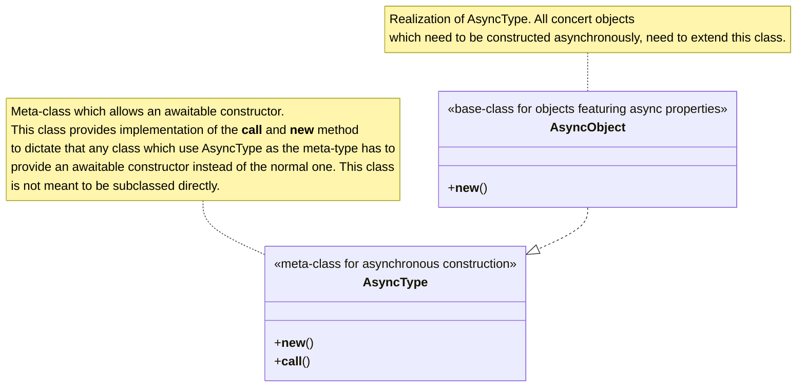
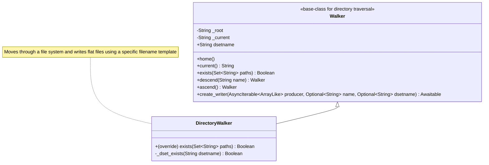
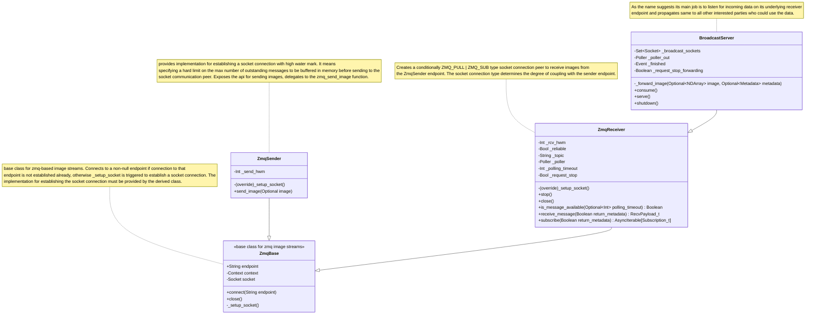
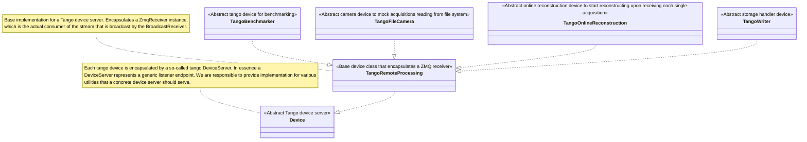
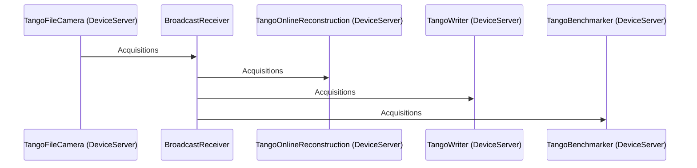

# Concert Design Document

> Work In Progress

This document encapsulates the internal development structure for concert. It would depict the API and implementation
layer objects and their relationships using UML diagrams. In the process we'd skip the private and less-relevant
attributes e.g., logger from the structures. The `-` and `+` denotes private and public members of an object respectively.

## Asynchronous Base Types

## Parameters Object Structure

## File System Traversal

## Decentralized Implementation

The [PyZMQ](https://pyzmq.readthedocs.io/en/latest/#) makes the backbone of the decentralized networking stack for
concert. Concretely, we define a base class `ZmqBase` which makes the high-level API for a socket connection. On top
of that we define `ZmqSender` and `ZmqReceiver` as two abstract endpoints engaged in a peer-2-peer socket connection.
The `ZmqBase` class does not dictate the nature of the socket connection, rather delegates that implementation to
its derived classes. At the time of writing we have conceived two alternative connection paradigms, namely PUSH-PULL
oriented strong-coupling and PUB-SUB oriented loose coupling. Furthermore, we defined a `BroadcastReceiver` class
extending the `ZmqReceiver` as a listening endpoint from a source and propagate to all potentially interested parties
listed as the parameter _broadcast\_endpoints_ for the class. Following is the class diagram of the ZMQ implementation
stack.

### Orchestration of Tango devices

