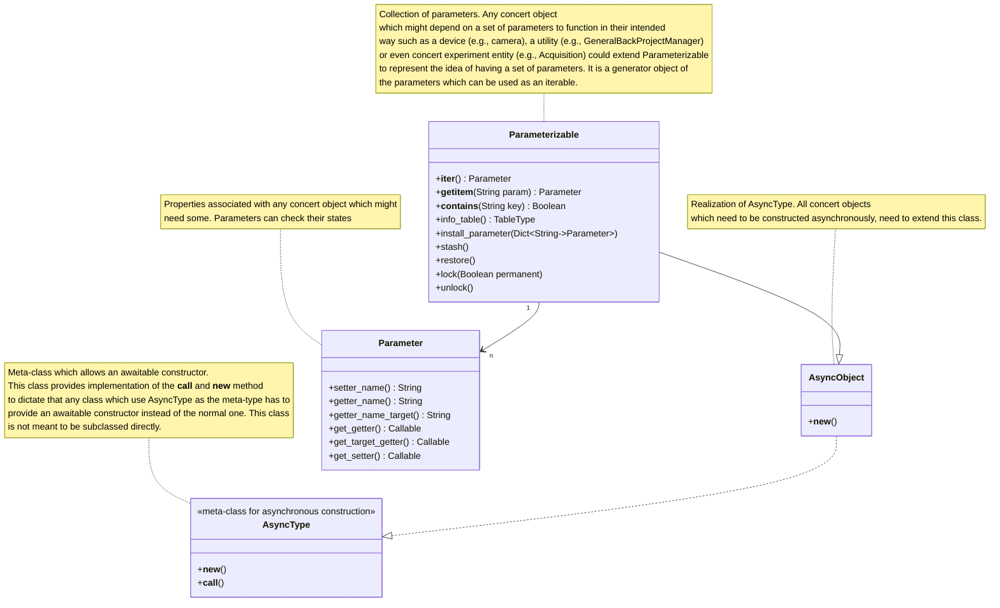

# Concert Design Document

This document encapsulates the internal development structure for concert. It would depict the API and implementation
layer objects and their relationships using UML diagrams. In the process we'd skip the private and less-relevant
attributes e.g., logger from the structures. The `-` and `+` denotes private and public members of an object respectively.

## Asynchronous Base Types

## Device Object Structures

> TODO

## File System Traversal

