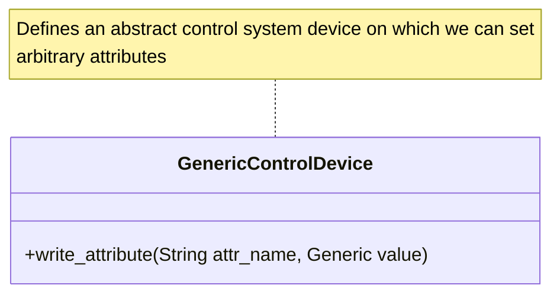
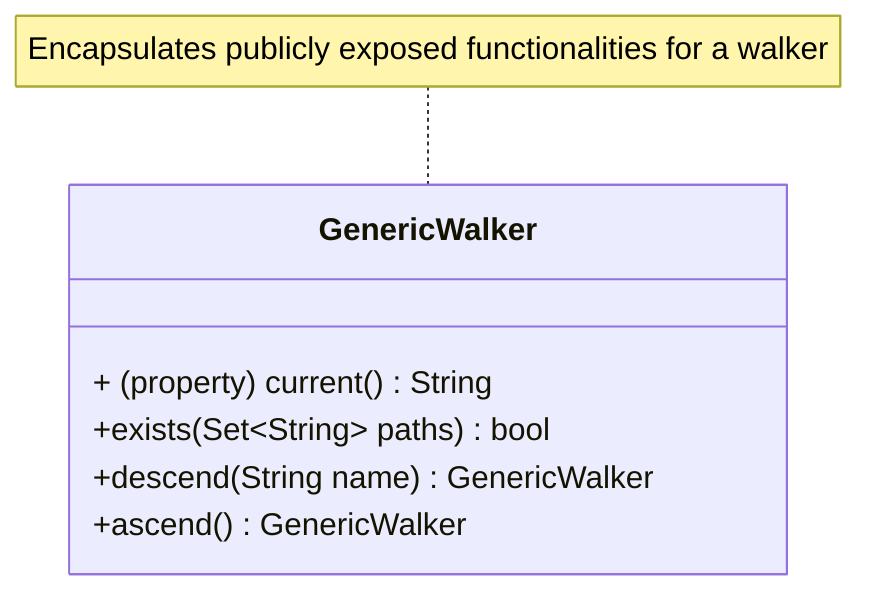

# Protocols

Protocols imply higher-layer interfaces of concert. We can categorize them as *internal* and *external* ones. As their
names suggest internal protocols are used to maintain good type-checking during implementation of functionalities and
contribute to relatively bug-free code in conjunction with type-checking with
[mypy](https://mypy.readthedocs.io/en/stable/index.html), while external protocols support our api layer making it more
intelligible for the concert users.

## External(API-Layer) Protocols

## Internal(Implementation-Layer) Protocols

